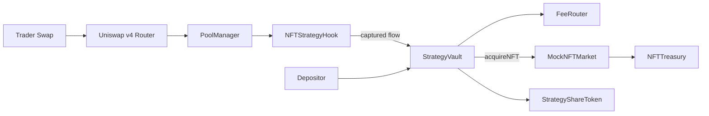
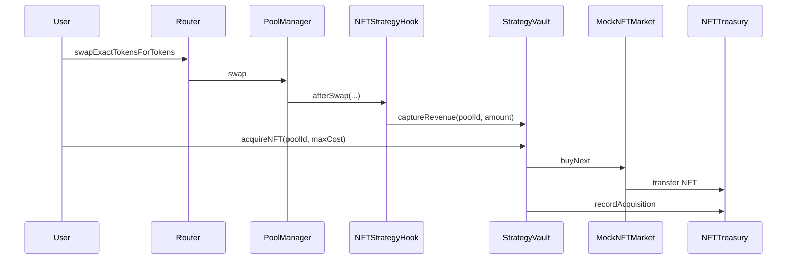
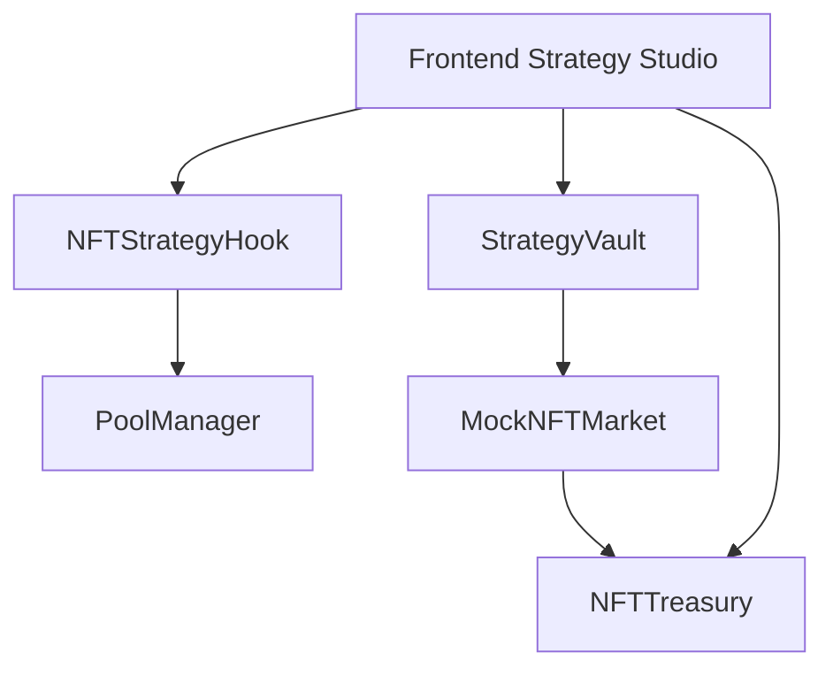

# NFT Strategy Token Hook


Production-oriented Uniswap v4 hook + vault system where deterministic hook-captured swap flow is routed into an NFT accumulation policy.

## Problem
LPs and strategy-token users can earn token-denominated value from swaps, but there is no deterministic, on-chain primitive that turns a share of strategy revenue into NFT treasury accumulation.

## Solution
This repo implements:
- `NFTStrategyHook`: v4 hook with `afterSwapReturnDelta` that captures a bounded share of swap flow.
- `StrategyVault`: receives captured revenue, mints/burns `StrategyShareToken`, triggers deterministic NFT buys.
- `FeeRouter`: per-pool split routing for strategy reserve vs optional treasury.
- `NFTTreasury`: auditable inventory accounting.
- `MockNFTMarket`: deterministic pricing model for fully local demos.

## Valuation Mode
MVP default is `ZERO_VALUE`:
- Share redemptions are backed by token balances only.
- NFTs are treasury collectibles and not counted for redemption value.
- This is conservative and avoids oracle complexity.

## Architecture


## Lifecycle


## Component Interaction


## Quickstart
```bash
./scripts/bootstrap.sh
forge test -vvv
make demo-local
```

## Demo Commands
- `make demo-local`
- `make demo-testnet`
- `make demo-nft-acquire`
- `make demo-all`

## Deployment
1. Copy `.env.example` values.
2. Run:
```bash
forge script script/10_DeployStrategyStack.s.sol:DeployStrategyStackScript \
  --rpc-url "$RPC_URL" \
  --broadcast
```
3. Configure pool policy:
```bash
forge script script/11_ConfigureStrategyPool.s.sol:ConfigureStrategyPoolScript \
  --rpc-url "$RPC_URL" \
  --broadcast
```

## Deployed Addresses
Fill after broadcast:

| Network | FeeRouter | Vault | Hook | Treasury | Market | Tx Hashes |
|---|---|---|---|---|---|---|
| Anvil | TBD | TBD | TBD | TBD | TBD | printed by `forge script` |
| Base Sepolia | TBD | TBD | TBD | TBD | TBD | TBD |

## Security Notes
- Hook entrypoints are restricted by `onlyPoolManager` (via `BaseHook`).
- Vault revenue capture restricted to `hook` address.
- Reentrancy guards on deposit/redeem/acquire/capture paths.
- Donation/first-depositor mitigations via virtual shares/assets.

A professional audit is required before any mainnet deployment.

## Docs
- [spec.md](spec.md)
- [docs/overview.md](docs/overview.md)
- [docs/architecture.md](docs/architecture.md)
- [docs/revenue-model.md](docs/revenue-model.md)
- [docs/nft-acquisition.md](docs/nft-acquisition.md)
- [docs/valuation.md](docs/valuation.md)
- [docs/security.md](docs/security.md)
- [docs/deployment.md](docs/deployment.md)
- [docs/demo.md](docs/demo.md)
- [docs/api.md](docs/api.md)
- [docs/testing.md](docs/testing.md)
- [docs/frontend.md](docs/frontend.md)

## Context Sources Used
Primary context loaded from:
- `context/unchain-readthedocs/` (cloned)

Additional protocol references used from local dependencies:
- `lib/uniswap-hooks/lib/v4-core/`
- `lib/uniswap-hooks/lib/v4-periphery/`
