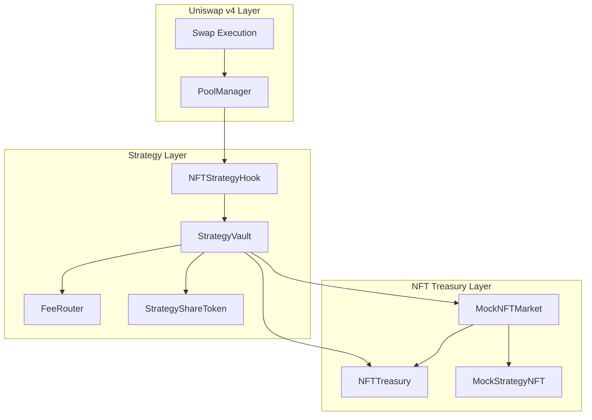
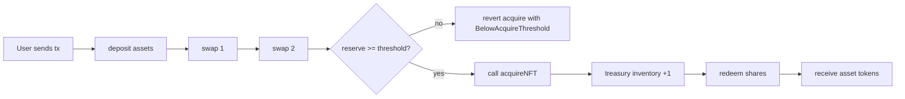
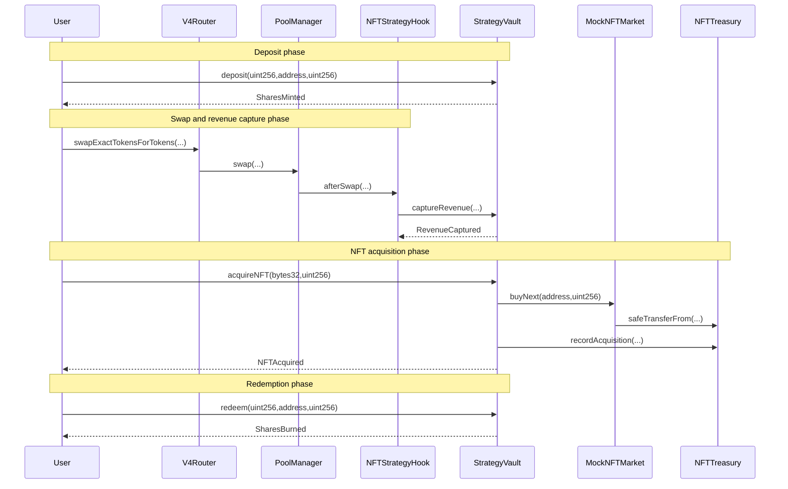
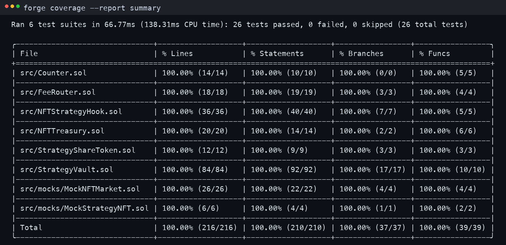

# NFT Strategy Token Hook
**Built on Uniswap v4 · Deployed on Unichain Sepolia**
_Targeting: Uniswap Foundation Prize · Unichain Prize_

> A Uniswap v4 hook plus strategy vault system that deterministically routes part of swap-captured revenue into NFT accumulation while preserving fungible share-token redemption.

[](https://github.com/smartman873/nft-strategy-token-hook/actions/workflows/test.yml)
[](/test)
[](/foundry.toml)
[](https://docs.uniswap.org/contracts/v4/overview)
[](https://sepolia.uniscan.xyz/)

## The Problem
A strategy vault that only tracks fungible balances cannot convert AMM fee generation into deterministic NFT treasury growth without introducing offchain bots or discretionary operators. In practical terms, a user can generate swap activity that creates protocol-level value, but the conversion path into NFT inventory is manual, delayed, and often non-auditable.

At the protocol level, LP fee accounting and strategy accounting are separated. Without a hook-level interception path, no contract can deterministically siphon a bounded share of swap flow at execution time and bind it to a transparent acquisition policy. The result is a fragmented execution path where value transfer depends on timing and trust assumptions outside the swap itself.

This creates measurable risk for strategy-token holders: revenue capture drifts, treasury inventory changes become hard to prove on-chain end-to-end, and redemption semantics become unclear when NFT assets are mixed into vault behavior without deterministic accounting rules.

## The Solution
The core insight is to treat a bounded share of swap flow as deterministic strategy revenue and enforce the full path from capture to NFT acquisition entirely on-chain.

Users or operators run normal pool actions and vault interactions. During swaps, the hook captures only configured revenue token flow and forwards it to the vault through a restricted call boundary. The vault then routes captured amount via `FeeRouter`, tracks per-pool reserve, and allows anyone to trigger `acquireNFT` once threshold is met.

At the Solidity level, the hook implements `beforeSwap`, `afterSwap`, and `afterSwapReturnDelta` permissions. `NFTStrategyHook._afterSwap(...)` computes capture amount, settles token flow with `CurrencySettler.take(...)`, and calls `StrategyVault.captureRevenue(...)` with policy data. `StrategyVault` is the state anchor for pool reserve, valuation mode, policy nonce, share mint/burn, and deterministic NFT purchase execution.

INVARIANT: only PoolManager can trigger hook swap callbacks — verified by `BaseHook` + `NFTStrategyHook._afterSwap(...)`.
INVARIANT: only configured hook can credit vault revenue — verified by `StrategyVault.captureRevenue(...)`.
INVARIANT: NFT acquisition cannot exceed available reserve — verified by `StrategyVault.acquireNFT(...)`.

## Architecture
### Component Overview
```text
NFTStrategyHook
  - Uniswap v4 hook; computes and captures bounded swap revenue share.
FeeRouter
  - Per-pool deterministic split policy (strategy reserve vs treasury recipient).
StrategyVault
  - Share mint/redeem, revenue accounting, threshold-gated NFT acquisition.
StrategyShareToken
  - Vault-only ERC20 shares for depositor accounting.
NFTTreasury
  - Custodies acquired NFTs and records inventory by pool and collection.
MockNFTMarket
  - Deterministic linear-pricing market used for reproducible demo acquisition.
MockStrategyNFT
  - Internal ERC721 minted only by the market contract.
```

### Architecture Flow


### User Perspective Flow


### Interaction Sequence


## Core Contracts & Components
### NFTStrategyHook
`NFTStrategyHook` exists to keep Uniswap v4 callback logic minimal and deterministic. It owns only per-pool revenue policy (`poolRevenueConfig`) and does not perform heavy vault or NFT operations directly.

Critical functions are `getHookPermissions()`, `setPoolRevenueConfig(PoolKey calldata, PoolRevenueConfig calldata)`, `_beforeSwap(...)`, and `_afterSwap(...)`. `_afterSwap(...)` computes captured amount from swap deltas and routes it via `strategyVault.captureRevenue(...)`.

Trust boundary is explicit: swap entrypoints are reachable only through `PoolManager` by `BaseHook`, while config mutation is `onlyOwner`. Invalid policy values revert through `NFTStrategyHook__InvalidRevenueShare`, `NFTStrategyHook__InvalidRevenueToken`, or `NFTStrategyHook__InvalidValuationMode`.

### StrategyVault
`StrategyVault` is the accounting core. It mints and burns `StrategyShareToken`, tracks per-pool reserve and policy metadata, enforces threshold-gated NFT acquisition, and performs deterministic route accounting through `FeeRouter`.

Critical functions are `deposit(uint256,address,uint256)`, `redeem(uint256,address,uint256)`, `captureRevenue(bytes32,address,uint256,uint128,uint8,uint64)`, and `acquireNFT(bytes32,uint256)`. It also exposes `previewDeposit`, `previewRedeem`, and `poolValuation` for deterministic accounting views.

Storage includes `poolPolicies` (acquire threshold, valuation mode, nonce, reserve, nftCount), immutable asset/router/treasury/market/shareToken references, and a mutable `hook` pointer. Unauthorized revenue capture reverts with `StrategyVault__OnlyHook`; stale policy updates revert with `StrategyVault__StalePolicyNonce`.

### FeeRouter
`FeeRouter` isolates split logic so policy changes do not alter hook math or vault accounting paths. It maintains `poolSplits` with `strategyBps`, `treasuryBps`, and `treasuryRecipient`.

Critical functions are `setPoolSplit(bytes32,uint16,uint16,address)`, `quoteRoute(bytes32,uint256)`, and `route(bytes32,uint256)`. The split must sum to `MAX_BPS` and treasury recipient is required when treasury share is non-zero.

### NFTTreasury
`NFTTreasury` exists as a dedicated ERC721 custody and inventory index module. It tracks per-pool inventory and per-collection token IDs without share accounting responsibilities.

Critical functions are `setVault(address)`, `recordAcquisition(bytes32,address,uint256,uint256)`, `inventoryForPool(bytes32)`, `inventoryCount(bytes32)`, and `tokenIdsForCollection(address)`.

Trust boundary is strict: only configured vault can call `recordAcquisition`, enforced by `NFTTreasury__OnlyVault`. Owner-only `sweep` is retained for emergency operations and documented as a trust assumption.

### StrategyShareToken
`StrategyShareToken` is intentionally thin: ERC20 share representation with vault-only mint/burn controls. It stores immutable `vault` and rejects unauthorized mint/burn via `StrategyShareToken__OnlyVault`.

### MockNFTMarket and MockStrategyNFT
`MockNFTMarket` gives deterministic, reproducible NFT acquisition for demos. Price is `basePrice + priceStep * nextTokenId`, with bounded inventory through `maxSupply`.

Critical functions are `quoteNextPrice()`, `floorPrice()`, and `buyNext(address,uint256)`. `buyNext` transfers payment, mints token in `MockStrategyNFT`, and transfers to treasury recipient.

`MockStrategyNFT` only exposes `mintForMarket(uint256)` and enforces market-only minting.

### Data Flow
A deposit calls `StrategyVault.deposit(...)`, transfers asset token to vault, and mints shares. A swap then reaches `NFTStrategyHook._afterSwap(...)`, which computes capture amount and settles it directly to vault before calling `StrategyVault.captureRevenue(...)`. Vault routes amount through `FeeRouter.route(...)`, updates `poolPolicies[poolId].revenueReserve`, and emits `RevenueCaptured`. Once reserve meets threshold, any caller invokes `StrategyVault.acquireNFT(...)`; vault checks reserve and threshold, calls `MockNFTMarket.buyNext(...)`, decrements reserve, increments `nftCount`, and writes inventory through `NFTTreasury.recordAcquisition(...)`. Redemption calls `StrategyVault.redeem(...)`, burns shares, and transfers proportional asset token back to the redeemer.

## Strategy Model
| Mode | Value in Share Redemption | Trigger Rule | Intended Use |
|---|---|---|---|
| `VALUATION_ZERO_VALUE (0)` | NFT inventory excluded | `revenueReserve >= acquireThreshold` | Safe default for deterministic accounting |
| `VALUATION_MOCK_FLOOR (1)` | Adds `nftCount * quoteNextPrice()` | Same threshold gate | Demo-only valuation behavior |

`VALUATION_ZERO_VALUE` is the default for production-like assumptions in this repository to minimize valuation manipulation surface.

## Deployed Contracts
### Unichain Sepolia (chainId 1301)
| Contract | Address |
|---|---|
| PoolManager | [0x00b036b58a818b1bc34d502d3fe730db729e62ac](https://sepolia.uniscan.xyz/address/0x00b036b58a818b1bc34d502d3fe730db729e62ac) |
| PositionManager | [0xf969aee60879c54baaed9f3ed26147db216fd664](https://sepolia.uniscan.xyz/address/0xf969aee60879c54baaed9f3ed26147db216fd664) |
| V4 Swap Router | [0x9cD2b0a732dd5e023a5539921e0FD1c30E198Dba](https://sepolia.uniscan.xyz/address/0x9cD2b0a732dd5e023a5539921e0FD1c30E198Dba) |
| Permit2 | [0x000000000022D473030F116dDEE9F6B43aC78BA3](https://sepolia.uniscan.xyz/address/0x000000000022D473030F116dDEE9F6B43aC78BA3) |
| Demo Token0 | [0x453a3FDBCCC2476Eaaa13c01CB17761eEc9a0d28](https://sepolia.uniscan.xyz/address/0x453a3FDBCCC2476Eaaa13c01CB17761eEc9a0d28) |
| Demo Token1 / Revenue Token | [0xdE08e00A44bBB424EFdB7Ce7cDBD437581cdf9d5](https://sepolia.uniscan.xyz/address/0xdE08e00A44bBB424EFdB7Ce7cDBD437581cdf9d5) |
| FeeRouter | [0x1468b3931Fa11c20DEa40dcfD1DbDcCF8Cc4A7cE](https://sepolia.uniscan.xyz/address/0x1468b3931Fa11c20DEa40dcfD1DbDcCF8Cc4A7cE) |
| NFTTreasury | [0x5b101FE55E4256b43403DE8520FA6D606D7031E7](https://sepolia.uniscan.xyz/address/0x5b101FE55E4256b43403DE8520FA6D606D7031E7) |
| MockNFTMarket | [0x2705b31114e379F273C3ce7aCb18a5E9517FE3Bc](https://sepolia.uniscan.xyz/address/0x2705b31114e379F273C3ce7aCb18a5E9517FE3Bc) |
| MockStrategyNFT | [0x5bbe893B91e2166d15926C3dBA5d0f513E323264](https://sepolia.uniscan.xyz/address/0x5bbe893B91e2166d15926C3dBA5d0f513E323264) |
| StrategyVault | [0xC64A3aC9Ba9C3D69beC599ABe4910AC17cA61dbf](https://sepolia.uniscan.xyz/address/0xC64A3aC9Ba9C3D69beC599ABe4910AC17cA61dbf) |
| NFTStrategyHook | [0x3fDF7f893e7E8AABc9829c9080058e7d06eE40C4](https://sepolia.uniscan.xyz/address/0x3fDF7f893e7E8AABc9829c9080058e7d06eE40C4) |
| StrategyShareToken | [0xc6f1F11579eBDe2A16D0564Aa795bacdbc744E83](https://sepolia.uniscan.xyz/address/0xc6f1F11579eBDe2A16D0564Aa795bacdbc744E83) |

## Live Demo Evidence
Demo run date: 2026-03-18 (Unichain Sepolia, chainId 1301).

### Phase 1: Policy Configuration
This phase proves deterministic policy wiring is active before user interaction. `FeeRouter.setPoolSplit(...)` sets 90% strategy and 10% treasury split for the pool, and `NFTStrategyHook.setPoolRevenueConfig(...)` commits revenue token, bps, threshold, valuation mode, and nonce.

[0x207f0162740ccb29288bcd10fd70347222f6c72b07c33ec3bf9b1b3e42bda42f](https://sepolia.uniscan.xyz/tx/0x207f0162740ccb29288bcd10fd70347222f6c72b07c33ec3bf9b1b3e42bda42f)  
[0x2098836df9dba46db9f6b04e63b805baf9d3903ce7db4bd49663223a4f9c541a](https://sepolia.uniscan.xyz/tx/0x2098836df9dba46db9f6b04e63b805baf9d3903ce7db4bd49663223a4f9c541a)

### Phase 2: Pool Liquidity and Share Mint
This phase proves the pool is live and user shares can be minted against vault assets. `IPositionManager.modifyLiquidities(...)` mints LP position, then user calls `StrategyVault.deposit(...)` which emits `SharesMinted`.

[0x6345d96814c0471408e743b0f296eb42ee42ab5ee3eb580a97f1d30b5d52191f](https://sepolia.uniscan.xyz/tx/0x6345d96814c0471408e743b0f296eb42ee42ab5ee3eb580a97f1d30b5d52191f)  
[0x79e81502fda9c785c0baf424857651f8d4ea0868d40537ff8bd12bebfe21a163](https://sepolia.uniscan.xyz/tx/0x79e81502fda9c785c0baf424857651f8d4ea0868d40537ff8bd12bebfe21a163)

### Phase 3: Swaps and Revenue Capture
This phase proves hook-driven capture works during normal swaps. Two `swapExactTokensForTokens(...)` calls cross the configured path and trigger hook `afterSwap`, resulting in vault `RevenueCaptured` updates and reserve growth toward threshold.

[0xcab92523142a99d888953ab064b296ad124785738c98f343e58d5fe7350feeaa](https://sepolia.uniscan.xyz/tx/0xcab92523142a99d888953ab064b296ad124785738c98f343e58d5fe7350feeaa)  
[0x15842f71ad53912d10f188f3f1b1333119cc4329eba52b0addeb2c3d228db510](https://sepolia.uniscan.xyz/tx/0x15842f71ad53912d10f188f3f1b1333119cc4329eba52b0addeb2c3d228db510)

### Phase 4: NFT Acquisition and Redemption
This phase proves threshold-gated acquisition and share redemption coexist correctly. `StrategyVault.acquireNFT(...)` buys from `MockNFTMarket`, records treasury inventory, and emits `NFTAcquired`; then `StrategyVault.redeem(...)` burns shares and returns redeemable asset balances.

[0xfb527268ed780eb2b8b74cbe5bc2d59ab494fe3d63ad981da9b6d0af7d17cd67](https://sepolia.uniscan.xyz/tx/0xfb527268ed780eb2b8b74cbe5bc2d59ab494fe3d63ad981da9b6d0af7d17cd67)  
[0x87fc588a9fe781f0f8156bbd703bea6e1a2b20b9f95aeeeed4c122c55417cc9a](https://sepolia.uniscan.xyz/tx/0x87fc588a9fe781f0f8156bbd703bea6e1a2b20b9f95aeeeed4c122c55417cc9a)

Complete proof chain result: fee policy was configured, swaps generated captured reserve, reserve crossed threshold, NFT inventory increased, and redemption still returned deterministic fungible claims.

## Running the Demo
```bash
# bootstrap pinned dependencies and remappings
make bootstrap

# full local demo flow
make demo-local

# full testnet demo flow with tx links
make demo-testnet
```

```bash
# run only NFT-acquire focused test path
make demo-nft-acquire

# run all local demo targets
make demo-all
```

## Test Coverage
```text
Lines:      100.00% (216/216)
Statements: 100.00% (210/210)
Branches:   100.00% (37/37)
Functions:  100.00% (39/39)
```



```bash
# reproduce exact coverage report
FOUNDRY_OFFLINE=true forge coverage --exclude-tests --no-match-coverage "script|test|lib" --report summary
```

- Unit tests validate each contract module behavior.
- Branch coverage tests force all error and success branches.
- Fuzz tests check conservation and routing properties.
- Integration tests execute hook-to-vault-to-market lifecycle.

## Repository Structure
```text
src/
script/
scripts/
test/
docs/
```

## Documentation Index
| Doc | Description |
|---|---|
| `spec.md` | Architectural spec and assumptions |
| `docs/overview.md` | High-level system narrative |
| `docs/architecture.md` | Contract and call-path architecture |
| `docs/revenue-model.md` | Fee split and reserve model |
| `docs/nft-acquisition.md` | Deterministic acquisition policy |
| `docs/valuation.md` | `ZERO_VALUE` vs `MOCK_FLOOR` tradeoffs |
| `docs/security.md` | Threats, mitigations, residual risks |
| `docs/deployment.md` | Deployment requirements and steps |
| `docs/demo.md` | End-to-end demo workflow |
| `docs/api.md` | Contract API reference |
| `docs/testing.md` | Test strategy and coverage |

## Key Design Decisions
**Why keep hook logic minimal?**  
Keeping capture logic in the hook and policy/accounting logic in vault modules reduces callback gas complexity and shrinks callback attack surface. Heavy state mutation is pushed to dedicated contracts.

**Why use `ZERO_VALUE` valuation by default?**  
Ignoring NFT mark-to-market in redemption removes oracle and manipulation complexity from core accounting. This keeps redemption deterministic and conservative.

**Why deterministic mock market first?**  
The mock market provides a reproducible acquisition path with no external dependency risk, which is essential for judge verification and local reproducibility.

## Roadmap
- [x] Uniswap v4 hook capture path on testnet
- [x] Deterministic vault revenue routing and acquisition
- [x] 100% forge coverage enforcement path
- [ ] Multi-pool strategy registry with role-gated policy updates
- [ ] Optional production marketplace adapters with strict slippage guards
- [ ] Formal verification of core accounting invariants

## License
MIT
