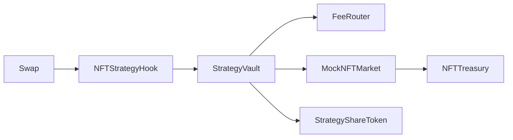

# Architecture

## Contracts
- `NFTStrategyHook`: swap hook capture logic.
- `StrategyVault`: revenue accounting, share mint/burn, NFT acquisition.
- `FeeRouter`: per-pool split policy.
- `NFTTreasury`: inventory custody.
- `MockNFTMarket` + `MockStrategyNFT`: deterministic demo market.

## Diagram

